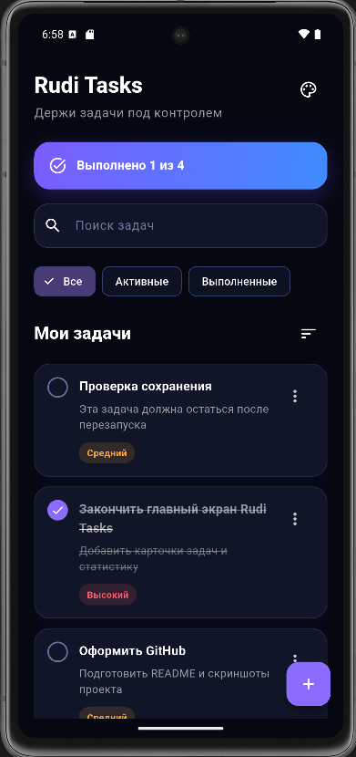
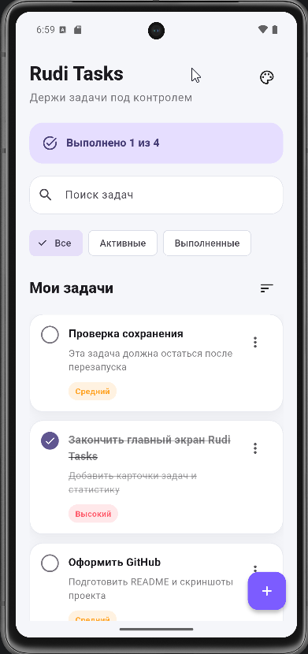
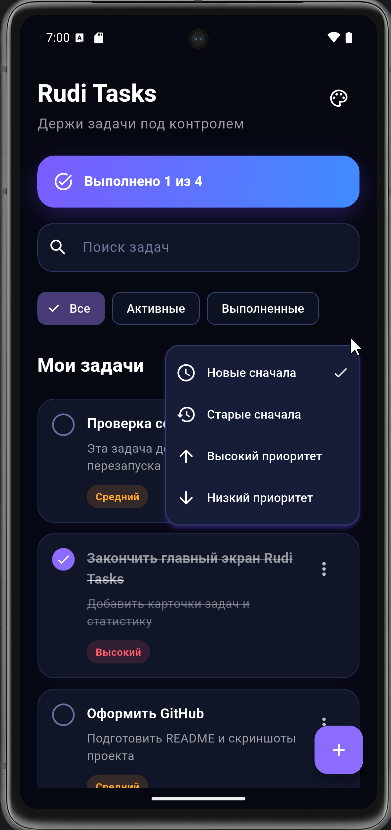
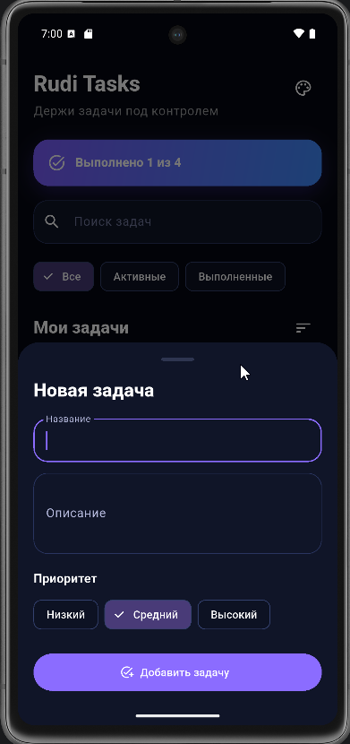

# Rudi Tasks

Rudi Tasks — компактный и современный менеджер задач на Flutter.

Проект создан как часть экосистемы **Rudi apps** и как демонстрационный проект для портфолио Flutter-разработчика.

## Возможности

- Создание задач
- Редактирование задач
- Удаление задач
- Отметка задач как выполненных
- Приоритеты задач: низкий, средний, высокий
- Фильтрация: все, активные, выполненные
- Поиск по названию и описанию
- Сортировка: новые сначала, старые сначала, высокий приоритет, низкий приоритет
- Локальное сохранение задач
- Сохранение состояния после перезапуска приложения
- Светлая тема
- Тёмная тема
- Фирменная тема Rudi
- Сохранение выбранной темы
- Красивые состояния для пустых списков и поиска

## Технологии

- Flutter
- Dart
- Material 3
- Shared Preferences
- Local Persistence
- flutter_launcher_icons

## Архитектура проекта

```text
lib/
├── main.dart
├── models/
│   └── task.dart
├── screens/
│   └── tasks/
│       ├── tasks_screen.dart
│       └── task_form_sheet.dart
├── services/
│   ├── task_storage_service.dart
│   ├── theme_controller.dart
│   └── theme_storage_service.dart
├── theme/
│   └── rudi_theme.dart
└── widgets/
    ├── task_card.dart
    └── tasks_empty_state.dart

## Темы

Rudi Tasks поддерживает три режима оформления:

- Light
- Dark
- Rudi

## Скриншоты

### Rudi



### Светлая тема



### Сортировка задач



### Создание задачи



### Rudi

Фирменная тема Rudi использует глубокий чёрно-синий фон, фиолетовые и синие акценты, отдельный градиентный блок прогресса и фирменные элементы интерфейса.

Выбранная тема автоматически сохраняется и восстанавливается после повторного запуска приложения.

## Локальное хранение

Задачи сохраняются локально с помощью `shared_preferences`.

Для каждой задачи сохраняются:

- название
- описание
- статус выполнения
- приоритет
- дата создания

Благодаря этому пользователь не теряет свои задачи после закрытия или перезапуска приложения.

## Поиск, фильтрация и сортировка

Поиск работает одновременно с фильтрацией и сортировкой.

Например:

Активные + поиск "Rudi" + высокий приоритет

Поиск выполняется по названию и описанию задачи.

Доступны фильтры:

- Все
- Активные
- Выполненные

Доступны варианты сортировки:

- Новые сначала
- Старые сначала
- Высокий приоритет
- Низкий приоритет

## Запуск проекта

Установить зависимости:

`flutter pub get`

Проверить проект:

`flutter analyze`

Запустить тесты:

`flutter test`

Запустить приложение:

`flutter run`

## Сборка APK

Для создания release APK:

`flutter build apk --release`

Готовый APK будет находиться здесь:

`build/app/outputs/flutter-apk/app-release.apk`

## Автор

**Daniil / Rudi apps**

GitHub: [RudiApps](https://github.com/RudiApps)

---

Part of the **Rudi apps** ecosystem.